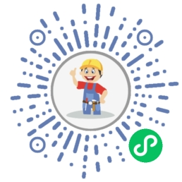

## Hi there 👋

### 我的博客
目前使用的 [阿里云部署99元服务器](https://www.aliyun.com/minisite/goods?userCode=r2v7kr9u) 部署， 

地址：[https://www.brandhuang.com](https://www.brandhuang.com);

> 静态博客，部署在 [netlify](https://www.netlify.com/) 上

静态博客地址： [https://blog.brandhuang.com](https://blog.brandhuang.com);

> 自己写的包含前后端和数据库，需要自己部署的博客系统，请看【[Personal-Blog-System](https://github.com/CQBoyBrand/Personal-Blog-System)】，欢迎star

### 我的公众号

### 我的小程序
> 面向娃编程，写了个微信小程序，目前支持算术题打印、自定义字帖打印、口算练习、汉字笔顺练习。欢迎扫码体验

<!--
**CQBoyBrand/CQBoyBrand** is a ✨ _special_ ✨ repository because its `README.md` (this file) appears on your GitHub profile.

Here are some ideas to get you started:

- 🔭 I’m currently working on ...
- 🌱 I’m currently learning ...
- 👯 I’m looking to collaborate on ...
- 🤔 I’m looking for help with ...
- 💬 Ask me about ...
- 📫 How to reach me: ...
- 😄 Pronouns: ...
- ⚡ Fun fact: ...
-->
